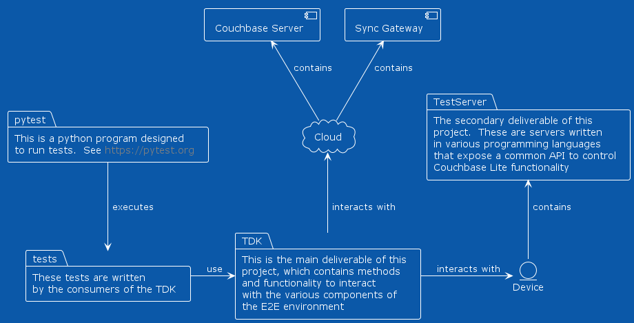

Concepts
========

Test Development Kit (TDK)
--------------------------

The deliverable of this project is called the Test Development Kit, or TDK for short.  It is like an SDK, and you can use it in the same way.  The only difference is that it is meant to be consumed by the testing library pytest, rather than a python program written by someone.  

Architecture
------------

In the above diagram you can see the expected deployment architecture of this solution.  The TDK facilitates development of tests written in python, using pytest as a runner, which can interact with the various test servers (contained in the servers directory of the GitHub repo for this project), Sync Gateway, and Couchbase Server.